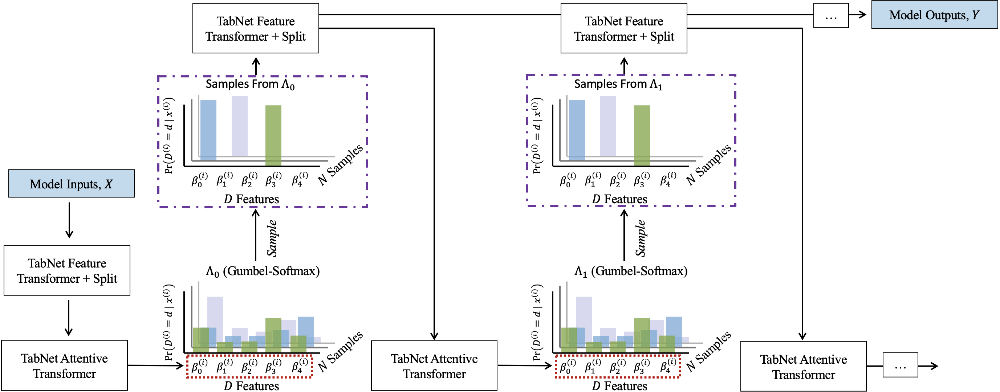
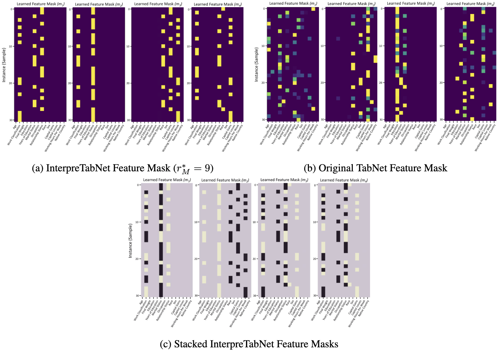

# InterpreTabNet: Distilling Predictive Signals from Tabular Data by Salient Feature Interpretation

<p align="center">
  <a href="https://arxiv.org/abs/2406.00426">
    
  </a>
  <a href="https://openreview.net/forum?id=or8BQ4ohGb">
    
  </a>
</p>

<div align="center">
  
  <p><em>Figure 1: The InterpreTabNet Architecture presenting a variational formulation of the TabNet encoder.</em>
</div>

<div align="center">
  
  <p><em>Figure 2: Left (a): Learned masks associated with InterpreTabNet. Right (b): Learned masks associated with TabNet. Bottom (c): Stacked InterpreTabNet Feature Masks between subsequent feature masks.</em>
</div>

## Usage

Clone this repository and navigate to it in your terminal. Install required packages and dependencies as follows.

```
conda create -n interpretabnet python=3.10
conda activate interpretabnet
```

```
pip install -r requirements.txt
```

To run InterpreTabNet with a desired dataset, it is recommended to use the "interpretabnet.ipynb" file for the most up-to-date codebase.
